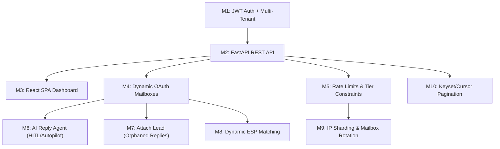

# AutoReach SaaS Transformation — Master Implementation Plan

> **Goal:** Transform AutoReach from an internal operator console into a scalable, multi-tenant SaaS cold email outbound engine, competing with Instantly.ai and Smartlead.ai.

---

## Current Architecture Snapshot

```
┌──────────────────────────────────────────────────────────────┐
│  Landing Page (React/Vite/Tailwind)  →  landing-page/       │
└──────────────────────────────────────────────────────────────┘

┌──────────────────────────────────────────────────────────────┐
│  Cockpit (FastAPI + Jinja2 SSR)      →  cockpit/            │
│    ├── routes/ (engagements, prospects, replies, meetings)   │
│    ├── templates/ (HTML Jinja2)                              │
│    └── static/                                               │
└──────────────────────────────────────────────────────────────┘

┌──────────────────────────────────────────────────────────────┐
│  Engine (Python, SQLAlchemy Core)    →  engine/              │
│    ├── core/ (types, protocols, state machine)               │
│    ├── adapters/ (Gmail real, console, token store)          │
│    ├── agents/ (OutboundAgentV1)                             │
│    ├── runtime/ (EngineRuntime, AdapterRegistry)             │
│    ├── services/ (operations, PnL, CSV ingest, reply det.)  │
│    ├── storage/ (SQLite via SQLAlchemy Core)                 │
│    └── llm/ (Gemini client, classifier, personalizer)        │
└──────────────────────────────────────────────────────────────┘

Database: SQLite (autoreach_engine.db)
Auth: None (single-operator console)
Token: Single file-based token.json
```

---

## Milestone Dependency Graph



---

## M1: JWT Authentication & Multi-Tenant Data Model

> **Priority:** 🔴 CRITICAL — Everything else depends on this.

### Why

The current cockpit has zero authentication. Every route is open. Before any SaaS feature can be built, we need user accounts, tenant isolation, and JWT-based API auth on every endpoint.

### Database Schema Additions

```sql
-- New table: tenants (organizations/companies)
CREATE TABLE tenants (
    id          VARCHAR PRIMARY KEY,
    name        VARCHAR NOT NULL,
    plan        VARCHAR NOT NULL DEFAULT 'free',   -- free | starter | pro | enterprise
    created_at  DATETIME NOT NULL,
    updated_at  DATETIME NOT NULL
);

-- New table: users (people within a tenant)
CREATE TABLE users (
    id          VARCHAR PRIMARY KEY,
    tenant_id   VARCHAR NOT NULL REFERENCES tenants(id),
    email       VARCHAR NOT NULL UNIQUE,
    password_hash VARCHAR NOT NULL,
    full_name   VARCHAR NOT NULL,
    role        VARCHAR NOT NULL DEFAULT 'member',  -- owner | admin | member
    is_active   BOOLEAN NOT NULL DEFAULT TRUE,
    created_at  DATETIME NOT NULL,
    updated_at  DATETIME NOT NULL
);

-- Add tenant_id to ALL existing tables
ALTER TABLE engagements ADD COLUMN tenant_id VARCHAR REFERENCES tenants(id);
ALTER TABLE prospects    ADD COLUMN tenant_id VARCHAR REFERENCES tenants(id);
ALTER TABLE jobs         ADD COLUMN tenant_id VARCHAR REFERENCES tenants(id);
ALTER TABLE events       ADD COLUMN tenant_id VARCHAR REFERENCES tenants(id);
ALTER TABLE cost_entries ADD COLUMN tenant_id VARCHAR REFERENCES tenants(id);
ALTER TABLE replies      ADD COLUMN tenant_id VARCHAR REFERENCES tenants(id);
ALTER TABLE meetings     ADD COLUMN tenant_id VARCHAR REFERENCES tenants(id);
```

### Proposed Changes

#### Engine Layer

##### [NEW] [auth.py](file:///Users/tarandeepsinghjuneja/AutoReach-AI/engine/auth/__init__.py)
New `engine/auth/` package:
- `engine/auth/__init__.py` — exports
- `engine/auth/models.py` — `Tenant`, `User` dataclasses (frozen, like existing core types)
- `engine/auth/jwt_handler.py` — `sign_jwt(user_id, tenant_id)`, `decode_jwt(token)` using `PyJWT` with HS256 + configurable secret via `AUTOREACH_JWT_SECRET` env var
- `engine/auth/jwt_bearer.py` — `JWTBearer(HTTPBearer)` class for FastAPI `Depends()` injection. Extracts token from `Authorization: Bearer <token>`, decodes, returns `CurrentUser` context
- `engine/auth/password.py` — `hash_password(plain)`, `verify_password(plain, hashed)` using `bcrypt`

##### [MODIFY] [types.py](file:///Users/tarandeepsinghjuneja/AutoReach-AI/engine/core/types.py)
- Add `tenant_id: Optional[str] = None` field to `Engagement`, `Prospect`, `Job`, `Event`, `CostEntry`, `Reply`, `Meeting`
- This is backward-compatible — existing single-tenant data has `tenant_id=None`

##### [MODIFY] [protocols.py](file:///Users/tarandeepsinghjuneja/AutoReach-AI/engine/core/protocols.py)
- Add optional `tenant_id` filter parameter to every `list_*` and `get_*` method on the `Store` protocol
- This enforces tenant isolation at the protocol level

##### [MODIFY] [sqlite.py](file:///Users/tarandeepsinghjuneja/AutoReach-AI/engine/storage/sqlite.py)
- Add `tenants` and `users` table definitions
- Add `tenant_id` column to all existing tables
- Add `WHERE tenant_id = :tid` clause to every query method
- Add `save_tenant()`, `get_tenant()`, `save_user()`, `get_user_by_email()` methods

#### Cockpit Layer

##### [NEW] [auth_routes.py](file:///Users/tarandeepsinghjuneja/AutoReach-AI/cockpit/routes/auth_routes.py)
- `POST /api/auth/signup` — create tenant + owner user, return JWT
- `POST /api/auth/login` — verify credentials, return JWT
- `GET /api/auth/me` — return current user + tenant info
- `POST /api/auth/refresh` — refresh JWT before expiry

##### [MODIFY] [app.py](file:///Users/tarandeepsinghjuneja/AutoReach-AI/cockpit/app.py)
- Register `auth_routes` router
- Add `JWTBearer` dependency to all API route groups

#### Dependencies

##### [MODIFY] [requirements.txt](file:///Users/tarandeepsinghjuneja/AutoReach-AI/requirements.txt)
- Add: `PyJWT>=2.8.0`, `bcrypt>=4.1.0`

### Verification
- Unit tests: create tenant → create user → login → get JWT → access protected route → verify tenant isolation
- Negative test: user A cannot access user B's engagements

---

## M2: FastAPI REST API (Decouple from Jinja)

> **Priority:** 🔴 CRITICAL — The React SPA needs pure JSON endpoints.

### Why

The current [cockpit/routes/](file:///Users/tarandeepsinghjuneja/AutoReach-AI/cockpit/routes) return `HTMLResponse` via Jinja2 templates. The React SPA needs pure REST JSON endpoints. We keep the existing Jinja routes intact (backward-compat) and add a parallel `/api/` prefix.

### Proposed Changes

##### [NEW] `cockpit/api/` directory
New REST API module structure:
```
cockpit/api/
├── __init__.py
├── campaigns.py        # GET/POST /api/campaigns, GET /api/campaigns/{id}
├── contacts.py         # GET/POST /api/contacts, POST /api/upload-contacts
├── sequences.py        # GET/POST /api/sequences (email steps)
├── inbox.py            # GET /api/inbox (unified inbox view)
├── analytics.py        # GET /api/analytics/dashboard
├── mailboxes.py        # GET/POST /api/mailboxes (M4 — stub now)
└── deps.py             # Shared FastAPI dependencies (current_user, get_store, etc.)
```

##### [MODIFY] `cockpit/api/campaigns.py`
Maps to existing engine concepts:
| React Endpoint | Engine Concept |
|---|---|
| `GET /api/campaigns` | `store.list_engagements(tenant_id=current.tenant_id)` |
| `POST /api/campaigns` | `ops.create_engagement(...)` + `ops.create_agent(...)` |
| `GET /api/campaigns/{id}` | `store.get_engagement(id)` + PnL report |
| `PATCH /api/campaigns/{id}` | Update engagement status/config |
| `DELETE /api/campaigns/{id}` | Soft-delete (status → cancelled) |

##### [MODIFY] `cockpit/api/contacts.py`
| React Endpoint | Engine Concept |
|---|---|
| `POST /api/upload-contacts` | `csv_ingest.ingest(file, engagement_id)` |
| `GET /api/contacts?campaign_id=X` | `store.list_prospects(engagement_id, ...)` |
| `GET /api/contacts/{id}` | `store.get_prospect(id)` |

##### [MODIFY] [app.py](file:///Users/tarandeepsinghjuneja/AutoReach-AI/cockpit/app.py)
- Mount `cockpit.api` router group under `/api` prefix
- Apply `JWTBearer` dependency to all `/api` routes
- Keep existing Jinja routes at `/engagements`, `/prospects` etc. for backward compatibility
- Add CORS middleware for React dev server (`http://localhost:5173`)

##### [NEW] `cockpit/api/deps.py`
Shared FastAPI dependencies:
```python
from fastapi import Depends, Request
from engine.auth import JWTBearer, CurrentUser

async def get_current_user(token = Depends(JWTBearer())) -> CurrentUser:
    return token

async def get_store(request: Request):
    return request.app.state.store

async def get_ops(request: Request):
    return request.app.state.ops
```

### Verification
- `curl -H "Authorization: Bearer <token>" http://localhost:8000/api/campaigns` returns JSON
- All endpoints return 401 without valid JWT
- Tenant A user cannot see Tenant B campaigns

---

## M3: React SPA Dashboard

> **Priority:** 🟡 HIGH — User-facing frontend.

### Why

Replace the Jinja2 server-rendered cockpit with a modern React SPA. The existing `landing-page/` already uses React 19 + Vite 8 + Tailwind v4, so we extend that or create a new `dashboard/` app.

### Proposed Changes

##### [NEW] `dashboard/` directory
New Vite + React 19 + Tailwind v4 app:
```
dashboard/
├── package.json
├── vite.config.js          # proxy /api → http://localhost:8000
├── src/
│   ├── main.jsx
│   ├── App.jsx             # React Router v7
│   ├── api/client.js       # axios/fetch wrapper with JWT interceptor
│   ├── contexts/
│   │   └── AuthContext.jsx  # JWT storage, login/logout, refresh
│   ├── pages/
│   │   ├── Login.jsx
│   │   ├── Signup.jsx
│   │   ├── Dashboard.jsx    # Campaign overview + analytics cards
│   │   ├── Campaigns.jsx    # List/create campaigns
│   │   ├── CampaignDetail.jsx
│   │   ├── Contacts.jsx     # Upload CSV, view leads with pagination
│   │   ├── Sequences.jsx    # Email sequence editor
│   │   ├── Inbox.jsx        # Unified inbox (replies)
│   │   ├── Mailboxes.jsx    # Connected email accounts
│   │   └── Settings.jsx     # User/tenant settings
│   ├── components/
│   │   ├── Sidebar.jsx
│   │   ├── TopBar.jsx
│   │   ├── CampaignCard.jsx
│   │   ├── ContactTable.jsx  # With cursor pagination
│   │   ├── EmailEditor.jsx   # Rich text + variable insertion
│   │   └── StatsCard.jsx
│   └── styles/
│       └── index.css         # Tailwind v4 imports + design tokens
```

##### [MODIFY] `dashboard/vite.config.js`
```js
export default defineConfig({
  server: {
    proxy: {
      '/api': {
        target: 'http://localhost:8000',
        changeOrigin: true,
      }
    }
  }
})
```

### Design Requirements
- Dark mode by default with glassmorphism cards
- Sidebar navigation (Campaigns, Contacts, Sequences, Inbox, Mailboxes, Analytics, Settings)
- Real-time stats cards (sent, opened, replied, bounced)
- CSV upload with field mapping UI (Papaparse on frontend)
- Responsive layout

### Verification
- `npm run dev` → dashboard loads at `localhost:5173`
- Login → see campaigns → create campaign → upload contacts → view in table
- All API calls proxied correctly through Vite

---

## M4: Dynamic OAuth Mailbox Management

> **Priority:** 🔴 CRITICAL — Core SaaS feature.

### Why

The current system uses a single `token.json` file ([JsonFileTokenStore](file:///Users/tarandeepsinghjuneja/AutoReach-AI/engine/adapters/gmail_token_store.py#L82)). For multi-tenant SaaS, each user connects their own Gmail/Outlook accounts. Credentials must be stored in the database, not on disk.

### Database Schema

```sql
CREATE TABLE mailboxes (
    id              VARCHAR PRIMARY KEY,
    tenant_id       VARCHAR NOT NULL REFERENCES tenants(id),
    user_id         VARCHAR NOT NULL REFERENCES users(id),
    provider        VARCHAR NOT NULL,  -- 'gmail' | 'outlook' | 'smtp'
    email_address   VARCHAR NOT NULL,
    display_name    VARCHAR,
    -- OAuth credentials (encrypted at rest)
    access_token    TEXT,
    refresh_token   TEXT,
    token_expiry    DATETIME,
    oauth_client_id VARCHAR,
    oauth_client_secret VARCHAR,
    -- Rate limits (M5)
    max_emails_per_day  INTEGER NOT NULL DEFAULT 50,
    emails_sent_today   INTEGER NOT NULL DEFAULT 0,
    last_send_reset     DATETIME,
    -- Health
    status          VARCHAR NOT NULL DEFAULT 'active',  -- active | paused | revoked | warming
    warmup_day      INTEGER NOT NULL DEFAULT 0,
    reputation_score FLOAT DEFAULT 1.0,
    last_error      TEXT,
    created_at      DATETIME NOT NULL,
    updated_at      DATETIME NOT NULL
);

-- Link campaigns to specific mailboxes (rotation pool)
CREATE TABLE campaign_mailboxes (
    campaign_id VARCHAR NOT NULL REFERENCES engagements(id),
    mailbox_id  VARCHAR NOT NULL REFERENCES mailboxes(id),
    PRIMARY KEY (campaign_id, mailbox_id)
);
```

### Proposed Changes

#### Engine Layer

##### [NEW] `engine/auth/oauth_flow.py`
- `start_google_oauth(redirect_uri)` → returns authorization URL
- `complete_google_oauth(code, redirect_uri)` → exchanges code for tokens, returns credentials dict
- Supports user-provided client_id/secret (BYOC) or platform centralized app

##### [NEW] `engine/adapters/db_token_store.py`
New `DbTokenStore` implementing the existing `GmailTokenStore` protocol:
```python
class DbTokenStore:
    """Database-backed token store. Replaces JsonFileTokenStore for SaaS."""

    def __init__(self, store, mailbox_id: str): ...

    def load(self) -> Credentials:
        mailbox = self.store.get_mailbox(mailbox_id)
        creds = Credentials(token=mailbox.access_token, ...)
        if creds.expired and creds.refresh_token:
            creds.refresh(Request())
            self.save(creds)  # persist refreshed token
        return creds

    def save(self, creds) -> None:
        # Update mailbox row with new access_token + expiry

    def mark_invalid(self, reason) -> None:
        # Set mailbox.status = 'revoked', mailbox.last_error = reason
```

##### [MODIFY] [email_gmail_real.py](file:///Users/tarandeepsinghjuneja/AutoReach-AI/engine/adapters/email_gmail_real.py)
- Accept `token_store: GmailTokenStore` (already does — no change needed!)
- The Protocol-based design means `DbTokenStore` drops in seamlessly

##### [MODIFY] [sqlite.py](file:///Users/tarandeepsinghjuneja/AutoReach-AI/engine/storage/sqlite.py)
- Add `mailboxes` and `campaign_mailboxes` table definitions
- Add `save_mailbox()`, `get_mailbox()`, `list_mailboxes(tenant_id)`, `get_mailboxes_for_campaign()`

#### Cockpit API Layer

##### [NEW] `cockpit/api/mailboxes.py`
- `GET /api/mailboxes` — list connected accounts for current tenant
- `POST /api/mailboxes/connect/google` — start OAuth flow → redirect to Google consent
- `GET /api/mailboxes/callback/google` — handle OAuth callback, store tokens in DB
- `DELETE /api/mailboxes/{id}` — disconnect mailbox
- `POST /api/mailboxes/{id}/test` — send test email to verify connection

#### Edge Cases to Handle
- Refresh tokens expire after 6 months unused → auto-detect, set `status='revoked'`, notify user
- User resets Google password → `invalid_grant` → pause mailbox, show "Reconnect" banner
- Token refresh race conditions → per-mailbox row-level locking

### Verification
- Connect Gmail account via OAuth flow → mailbox appears in list
- Send test email from connected mailbox → success
- Revoke token in Google settings → next send attempt marks mailbox as `revoked`
- Campaign sends rotate across multiple connected mailboxes

---

## M5: Engine-Level Rate Limits & Tier Constraints

> **Priority:** 🟡 HIGH — Protects deliverability and sender reputation.

### Why

Without per-mailbox and per-campaign send limits, a single user can destroy their sender reputation in one afternoon. These constraints also form the foundation for commercial tier enforcement later.

### Database Schema Additions

```sql
-- Add to mailboxes (already in M4):
--   max_emails_per_day INTEGER DEFAULT 50
--   emails_sent_today  INTEGER DEFAULT 0
--   last_send_reset    DATETIME

-- Add to engagements:
ALTER TABLE engagements ADD COLUMN max_leads_per_day INTEGER DEFAULT 100;
ALTER TABLE engagements ADD COLUMN max_emails_per_day INTEGER DEFAULT 200;
ALTER TABLE engagements ADD COLUMN sending_window_start INTEGER DEFAULT 8;  -- 8 AM
ALTER TABLE engagements ADD COLUMN sending_window_end INTEGER DEFAULT 18;   -- 6 PM
ALTER TABLE engagements ADD COLUMN sending_timezone VARCHAR DEFAULT 'UTC';

-- New table: tenant plan limits
CREATE TABLE plan_limits (
    plan            VARCHAR PRIMARY KEY,  -- free | starter | pro | enterprise
    max_mailboxes   INTEGER NOT NULL DEFAULT 1,
    max_campaigns   INTEGER NOT NULL DEFAULT 1,
    max_leads_total INTEGER NOT NULL DEFAULT 500,
    max_emails_day  INTEGER NOT NULL DEFAULT 50,
    max_warmup_mailboxes INTEGER NOT NULL DEFAULT 0,
    features_json   JSON    -- feature flags per plan
);
```

### Proposed Changes

##### [NEW] `engine/policies/rate_limiter.py`
```python
class SendRateLimiter:
    """Checks per-mailbox and per-campaign daily limits before dispatch."""

    def can_send(self, mailbox_id: str, campaign_id: str) -> tuple[bool, str]:
        """Returns (allowed, reason). Checks:
        1. mailbox.emails_sent_today < mailbox.max_emails_per_day
        2. campaign daily send count < campaign.max_emails_per_day
        3. Current time within campaign sending_window
        4. Tenant within plan limits
        """

    def record_send(self, mailbox_id: str) -> None:
        """Increment emails_sent_today for the mailbox."""

    def reset_daily_counters(self) -> None:
        """Cron job: reset emails_sent_today at midnight per timezone."""
```

##### [MODIFY] [runtime.py](file:///Users/tarandeepsinghjuneja/AutoReach-AI/engine/runtime/runtime.py)
- Before dispatching a job, call `rate_limiter.can_send()`
- If denied, set `job.not_before` to next available window and keep as `pending`

##### [NEW] `cockpit/api/billing.py`
- `GET /api/billing/usage` — current month's usage vs plan limits
- `GET /api/billing/plan` — current plan details

### Verification
- Set mailbox limit to 5/day → 6th send returns "rate limited"
- Set campaign sending window 9-17 → jobs outside window are deferred
- Plan "free" with max 1 mailbox → adding 2nd mailbox returns 403

---

## M6: AI Reply Agent with HITL & Autopilot

> **Priority:** 🟡 HIGH — Key differentiator feature.

### Why

The current [reply_detector.py](file:///Users/tarandeepsinghjuneja/AutoReach-AI/engine/services/reply_detector.py) already classifies replies (interested/objection/auto/unsubscribe) and drafts suggested responses using the [Gemini classifier](file:///Users/tarandeepsinghjuneja/AutoReach-AI/engine/llm/classifier.py). We need to extend this with two modes and automated actions.

### Proposed Changes

##### [MODIFY] [classifier.py](file:///Users/tarandeepsinghjuneja/AutoReach-AI/engine/llm/classifier.py)
Add new classification categories:
```python
CLASSIFICATIONS = [
    "interested",       # → Auto-draft reply with calendar link
    "not_interested",   # → Mark lead as dead, stop sequence
    "out_of_office",    # → Extract return date, pause & reschedule
    "referral",         # → Create new prospect from referral info
    "do_not_contact",   # → Immediate unsubscribe + blocklist
    "auto",             # → OOO auto-responder (existing)
    "objection",        # → Draft handling response
]
```

##### [NEW] `engine/services/reply_actions.py`
```python
class ReplyActionExecutor:
    """Executes automated actions based on reply classification."""

    def execute(self, reply: Reply, classification: str, mode: str) -> None:
        if classification == "interested":
            self._draft_calendar_reply(reply)
        elif classification == "out_of_office":
            self._pause_and_reschedule(reply)
        elif classification == "do_not_contact":
            self._unsubscribe_and_blocklist(reply)
        elif classification == "referral":
            self._create_referral_prospect(reply)

        if mode == "autopilot":
            self._send_draft_immediately(reply)
        elif mode == "hitl":
            self._flag_for_approval(reply)
```

##### [MODIFY] Database
```sql
ALTER TABLE agents ADD COLUMN reply_mode VARCHAR DEFAULT 'hitl';  -- 'hitl' | 'autopilot'
```

##### [NEW] `cockpit/api/inbox.py`
- `GET /api/inbox` — unified inbox with categorized replies
- `POST /api/inbox/{reply_id}/approve` — approve AI-drafted response
- `POST /api/inbox/{reply_id}/edit` — edit and send
- `POST /api/inbox/{reply_id}/discard` — discard draft
- `PATCH /api/campaigns/{id}/reply-mode` — toggle HITL ↔ Autopilot

### Verification
- Receive "interested" reply → AI drafts calendar link reply → appears in inbox for approval (HITL mode)
- Switch to Autopilot → next interested reply auto-sends the draft
- OOO reply → prospect auto-paused, follow-up rescheduled to return date

---

## M7: "Attach Lead" for Orphaned Replies

> **Priority:** 🟢 MEDIUM — Solves a real pain point.

### Why

When a prospect forwards your email to a colleague, or replies from a personal email, the system can't match it to the original lead. These orphaned replies sit in an "Others" folder.

### Proposed Changes

##### [NEW] Database table
```sql
CREATE TABLE orphaned_replies (
    id              VARCHAR PRIMARY KEY,
    tenant_id       VARCHAR NOT NULL REFERENCES tenants(id),
    mailbox_id      VARCHAR NOT NULL REFERENCES mailboxes(id),
    from_email      VARCHAR NOT NULL,
    from_name       VARCHAR,
    subject         VARCHAR,
    snippet         TEXT,
    gmail_message_id VARCHAR,
    gmail_thread_id  VARCHAR,
    attached_prospect_id VARCHAR REFERENCES prospects(id),  -- NULL until attached
    status          VARCHAR DEFAULT 'unmatched',  -- unmatched | attached | ignored
    received_at     DATETIME NOT NULL,
    created_at      DATETIME NOT NULL
);
```

##### [MODIFY] [reply_detector.py](file:///Users/tarandeepsinghjuneja/AutoReach-AI/engine/services/reply_detector.py)
- When a reply comes from an unknown email (not matching any prospect), save to `orphaned_replies` instead of dropping it
- Currently these are silently skipped

##### [NEW] `cockpit/api/orphaned.py`
- `GET /api/inbox/others` — list unmatched orphaned replies
- `POST /api/inbox/others/{id}/attach` — link to existing prospect, halt their sequence
- `POST /api/inbox/others/{id}/ignore` — mark as ignored

### Verification
- Forward a campaign email from a different account → appears in "Others" tab
- Click "Attach Lead" → link to original prospect → sequence stops for that prospect
- Verify duplicate forwarded replies are deduped

---

## M8: Dynamic ESP Matching

> **Priority:** 🟢 MEDIUM — Deliverability optimization.

### Why

Gmail-to-Gmail emails have significantly higher primary inbox placement than Gmail-to-Outlook. By checking the prospect's MX records and routing through the matching provider, we boost deliverability.

### Proposed Changes

##### [NEW] `engine/services/esp_matcher.py`
```python
import dns.resolver  # using dnspython (already in requirements.txt)

class ESPMatcher:
    """Determines a prospect's email provider via MX record lookup."""

    PROVIDER_PATTERNS = {
        "google":    ["google.com", "googlemail.com", "aspmx.l.google.com"],
        "microsoft": ["outlook.com", "protection.outlook.com", "microsoft.com"],
        "zoho":      ["zoho.com", "zoho.in"],
    }

    def detect_provider(self, email: str) -> str:
        """Returns 'google' | 'microsoft' | 'zoho' | 'other'."""
        domain = email.split("@")[1]
        mx_records = dns.resolver.resolve(domain, "MX")
        for mx in mx_records:
            exchange = str(mx.exchange).lower()
            for provider, patterns in self.PROVIDER_PATTERNS.items():
                if any(p in exchange for p in patterns):
                    return provider
        return "other"

    def select_mailbox(self, prospect_email: str, available_mailboxes: list) -> Mailbox:
        """Pick the best mailbox for this prospect based on ESP match."""
        target_provider = self.detect_provider(prospect_email)
        # Prefer same-provider mailbox, fallback to any available
        for mb in available_mailboxes:
            if mb.provider == target_provider:
                return mb
        return available_mailboxes[0]  # fallback
```

##### [MODIFY] [runtime.py](file:///Users/tarandeepsinghjuneja/AutoReach-AI/engine/runtime/runtime.py)
- Before dispatching an email job, call `esp_matcher.select_mailbox()` to pick the optimal sending account
- Cache MX lookups per domain (TTL: 24h) to avoid repeated DNS queries

##### [MODIFY] Database
```sql
-- Cache MX lookups
CREATE TABLE mx_cache (
    domain      VARCHAR PRIMARY KEY,
    provider    VARCHAR NOT NULL,
    mx_records  JSON,
    cached_at   DATETIME NOT NULL,
    expires_at  DATETIME NOT NULL
);
```

### Verification
- Upload list with mix of Gmail and Outlook recipients
- Verify Gmail recipients get emails from Gmail mailbox, Outlook from Outlook mailbox
- Verify MX cache is populated and respected

---

## M9: Server/IP Sharding & Mailbox Health Rotation

> **Priority:** 🟢 MEDIUM — Enterprise-scale feature.

### Why

When a specific mailbox or IP starts experiencing high bounce rates or spam placements, the system should automatically pause it and rotate in a healthy mailbox from a reserve pool.

### Proposed Changes

##### [NEW] `engine/services/mailbox_health.py`
```python
class MailboxHealthMonitor:
    """Monitors mailbox health and auto-rotates unhealthy senders."""

    BOUNCE_THRESHOLD = 0.05      # 5% bounce rate → pause
    SPAM_THRESHOLD = 0.02        # 2% spam rate → pause
    WARMUP_RAMP = [10, 15, 25, 40, 60, 80, 100, 150]  # daily limits by warmup day

    def check_health(self, mailbox_id: str) -> HealthStatus:
        """Calculate bounce rate, spam rate, reputation score."""

    def auto_rotate(self, campaign_id: str, unhealthy_mailbox_id: str) -> Optional[str]:
        """Pause unhealthy mailbox, activate next healthy reserve mailbox."""

    def warmup_tick(self) -> None:
        """Daily cron: increment warmup_day, adjust max_emails_per_day."""
```

##### [MODIFY] Database
```sql
-- Track per-mailbox health metrics
CREATE TABLE mailbox_metrics (
    id          VARCHAR PRIMARY KEY,
    mailbox_id  VARCHAR NOT NULL REFERENCES mailboxes(id),
    date        DATE NOT NULL,
    sent        INTEGER DEFAULT 0,
    delivered   INTEGER DEFAULT 0,
    bounced     INTEGER DEFAULT 0,
    spam_reports INTEGER DEFAULT 0,
    opens       INTEGER DEFAULT 0,
    replies     INTEGER DEFAULT 0,
    UNIQUE(mailbox_id, date)
);
```

##### [MODIFY] [runtime.py](file:///Users/tarandeepsinghjuneja/AutoReach-AI/engine/runtime/runtime.py)
- After each send, update `mailbox_metrics`
- On bounce/spam event, call `health_monitor.check_health()` → auto-rotate if threshold exceeded

### Verification
- Simulate 5% bounce rate on a mailbox → auto-paused, reserve activated
- Warmup schedule: new mailbox starts at 10/day, ramps to 100+ over 8 days
- Dashboard shows health indicators (green/yellow/red) per mailbox

---

## M10: Keyset/Cursor Pagination for Leads API

> **Priority:** 🟡 HIGH — Performance at scale.

### Why

Users upload 100k+ lead lists. Standard `OFFSET` pagination degrades at depth (page 1000 = full table scan). Keyset pagination guarantees consistent O(1) page loads.

### Proposed Changes

##### [MODIFY] [sqlite.py](file:///Users/tarandeepsinghjuneja/AutoReach-AI/engine/storage/sqlite.py)
Replace offset-based pagination with cursor-based:
```python
def list_prospects_cursor(
    self,
    engagement_id: str,
    *,
    cursor: Optional[str] = None,  # last prospect ID from previous page
    limit: int = 50,
    tenant_id: Optional[str] = None,
) -> tuple[list[Prospect], Optional[str]]:
    """Returns (prospects, next_cursor).
    Uses WHERE id > :cursor ORDER BY id ASC LIMIT :limit+1
    """
    query = select(prospects_table).where(
        prospects_table.c.engagement_id == engagement_id
    )
    if tenant_id:
        query = query.where(prospects_table.c.tenant_id == tenant_id)
    if cursor:
        query = query.where(prospects_table.c.id > cursor)
    query = query.order_by(prospects_table.c.id.asc()).limit(limit + 1)

    results = list(self._execute(query))
    has_more = len(results) > limit
    items = results[:limit]
    next_cursor = items[-1].id if has_more and items else None
    return items, next_cursor
```

##### [MODIFY] `cockpit/api/contacts.py`
```python
@router.get("/api/contacts")
async def list_contacts(
    campaign_id: str,
    cursor: Optional[str] = None,
    limit: int = Query(default=50, le=200),
    user: CurrentUser = Depends(get_current_user),
):
    prospects, next_cursor = store.list_prospects_cursor(
        campaign_id, cursor=cursor, limit=limit, tenant_id=user.tenant_id
    )
    return {
        "data": [p.to_dict() for p in prospects],
        "next_cursor": next_cursor,
        "has_more": next_cursor is not None,
    }
```

##### [MODIFY] `dashboard/src/components/ContactTable.jsx`
- Implement infinite scroll or "Load More" using the cursor
- Cache previously loaded pages in React state for smooth scrolling

### Verification
- Seed 100k prospects → page through all without performance degradation
- Measure: page 1 load time ≈ page 1000 load time (both < 20ms)
- Verify cursor stability (inserting new records doesn't shift pages)

---

## Open Questions

> [!IMPORTANT]
> **Q1: Database migration strategy?**
> Should we migrate from SQLite to PostgreSQL as part of M1 (recommended for production multi-tenant), or keep SQLite for now and migrate later? The existing SQLAlchemy Core schema is designed to be engine-agnostic (see [sqlite.py line 9](file:///Users/tarandeepsinghjuneja/AutoReach-AI/engine/storage/sqlite.py#L9): "same Table definitions work against Postgres in Phase 5 with zero model changes").

> [!IMPORTANT]
> **Q2: Dashboard as separate app or extend landing-page?**
> Create a new `dashboard/` Vite app (recommended — clean separation) or extend the existing [landing-page/](file:///Users/tarandeepsinghjuneja/AutoReach-AI/landing-page) with routing? Landing page is currently a single 162KB [App.jsx](file:///Users/tarandeepsinghjuneja/AutoReach-AI/landing-page/src/App.jsx) monolith.

> [!IMPORTANT]
> **Q3: Google OAuth for mailboxes — centralized app or BYOC first?**
> Should we build a centralized Google Cloud OAuth app (easier UX, but requires Google verification review which takes weeks) or start with Bring-Your-Own-Credentials (user pastes their own client_id/secret)?

> [!IMPORTANT]
> **Q4: Which milestones to tackle first?**
> Recommended order: **M1 → M2 → M10 → M4 → M5 → M3 → M6 → M7 → M8 → M9**. M1/M2 are foundational. M10 is low-effort/high-impact. M4/M5 unlock the SaaS core. M3 is the frontend sprint. M6-M9 are differentiator features. Agree with this ordering?

---

## Verification Plan

### Automated Tests
```bash
# After each milestone
PYTHONPATH=. .venv/bin/pytest tests/ -v

# API integration tests
PYTHONPATH=. .venv/bin/pytest tests/api/ -v

# Load test for pagination (M10)
PYTHONPATH=. .venv/bin/python scripts/load_test_pagination.py
```

### Manual Verification
- After M1+M2: curl-based API test suite
- After M3: full signup → login → create campaign → upload contacts → send flow in browser
- After M4: connect real Gmail account via OAuth, send test email
- After M6: receive reply, verify AI classification and draft in inbox

---

## Summary Table

| Milestone | Description | Effort | Depends On | Key Files |
|-----------|------------|--------|------------|-----------|
| **M1** | JWT Auth + Multi-Tenant | 3-4 days | — | `engine/auth/`, `sqlite.py`, `types.py` |
| **M2** | FastAPI REST API | 3-4 days | M1 | `cockpit/api/`, `app.py` |
| **M3** | React SPA Dashboard | 5-7 days | M2 | `dashboard/` (new) |
| **M4** | Dynamic OAuth Mailboxes | 4-5 days | M2 | `engine/adapters/db_token_store.py`, `oauth_flow.py` |
| **M5** | Rate Limits & Tiers | 2-3 days | M2 | `engine/policies/rate_limiter.py` |
| **M6** | AI Reply Agent HITL | 3-4 days | M4 | `reply_actions.py`, `classifier.py` |
| **M7** | Attach Lead (Orphaned) | 1-2 days | M4 | `orphaned_replies` table, `reply_detector.py` |
| **M8** | Dynamic ESP Matching | 2-3 days | M4 | `esp_matcher.py`, `mx_cache` table |
| **M9** | IP Sharding & Rotation | 3-4 days | M5 | `mailbox_health.py`, `mailbox_metrics` table |
| **M10** | Cursor Pagination | 1-2 days | M2 | `sqlite.py`, `contacts.py` |

**Total estimated effort: 28-38 days** (working sequentially, one milestone at a time)
